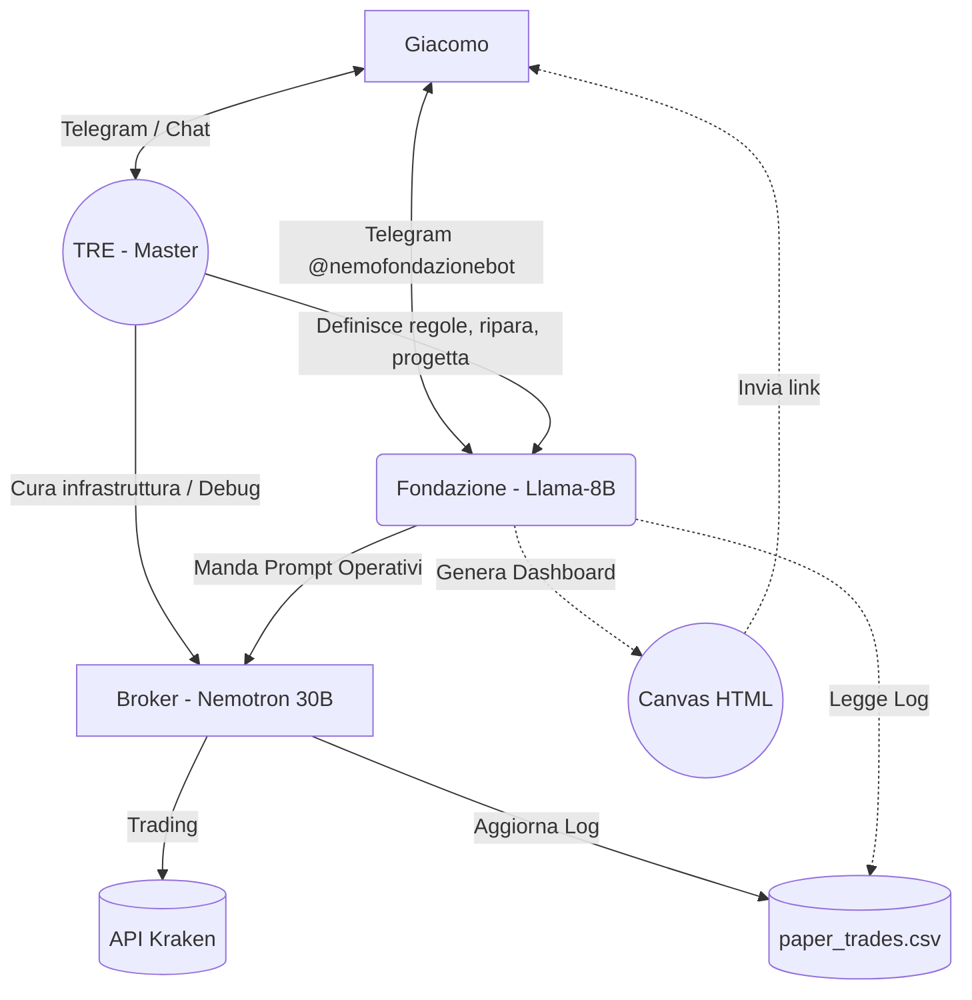

# Workflow Definitivo: Fondazione Idra (Architettura Tripartita)

## 📌 Attori e Modelli (Le 3 Teste dell'Idra)

1.  **TRE (Il Master Orchestratore / Amministratore)**
    *   **Piattaforma:** Interfaccia WebChat principale / Terminale.
    *   **Modello:** Gemini 3.5 Flash / Gemini 3.1 Pro (Modello ad alta capacità di ragionamento).
    *   **Ruolo:** È l'entità suprema (io). Ha il controllo su tutta l'infrastruttura. Aggiusta gli agenti, consolida le regole, progetta nuove skill, e comunica le strategie all'agente "Fondazione". Se il server VPS cade o un agente va in loop, TRE interviene per riparare l'ambiente. Può comunicare messaggi e direttive dall'alto a chiunque.

2.  **Agente `fondazione` (Il Segretario / Front-End)**
    *   **Piattaforma:** Telegram (`@nemofondazionebot`).
    *   **Modello:** `Llama-3.1-8B-Instruct` (Locale su VPS `100.73.54.72:8081`).
    *   **Capacità VRAM/Context:** ~5 GB VRAM | Context: 128.000 token.
    *   **Ruoli Principali:**
        *   **Interfaccia Utente:** Risponde a Giacomo su Telegram in linguaggio naturale.
        *   **Traduttore/Dispatcher:** Riceve strategie (da Giacomo o da TRE) e le traduce in ordini rigidi per il Broker. Innesca loop operativi.
        *   **Reporter (Canvas):** Interroga il CSV e i tool di balance, genera dashboard HTML grafiche per riassumere il PnL e la situazione operativa a Giacomo. Non trada mai direttamente.
    
3.  **Agente `broker` (Il Motore di Trading / L'Esecutore)**
    *   **Piattaforma:** Nessun canale utente. Opera in background o tramite loop cron.
    *   **Modello:** `Nemotron-3-Nano-30B-A3B` (Locale su VPS `100.73.54.72:8080`).
    *   **Capacità VRAM/Context:** ~22 GB VRAM | Context: 16.384 token.
    *   **Ruoli Principali:**
        *   **Il Soldato in Gabbia:** Viene svegliato da `fondazione` o da `TRE`. Applica i modelli quantitativi sui dati Kraken (`ticker`, `orderbook`), clicca materialmente `kraken_paper_buy` o `kraken_paper_sell`.
        *   **Stateless Logger:** Alla fine del suo turno, scrive una riga sul file `/home/tre/.openclaw/workspace/paper_trades_aggressivo.csv` usando il comando `exec` e termina il processo. La sua memoria deve rimanere snella. Non chiacchiera mai.

---

## 🔄 Catena di Comando & Flusso di Lavoro

